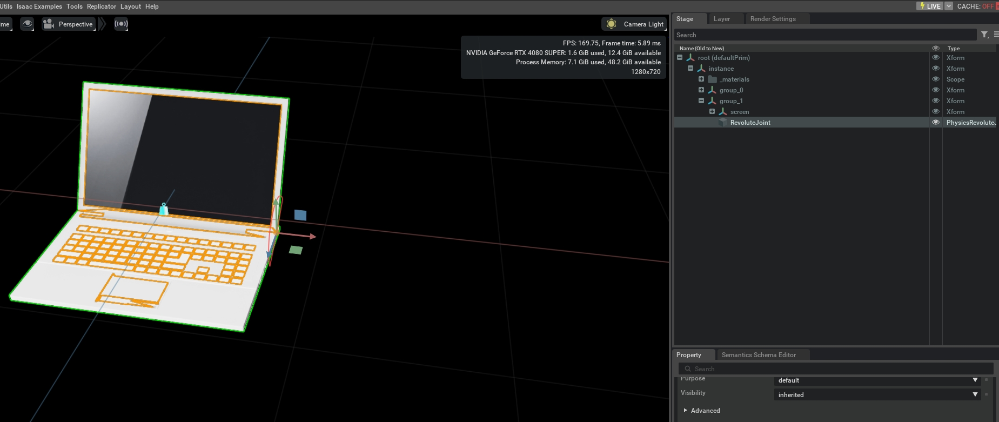
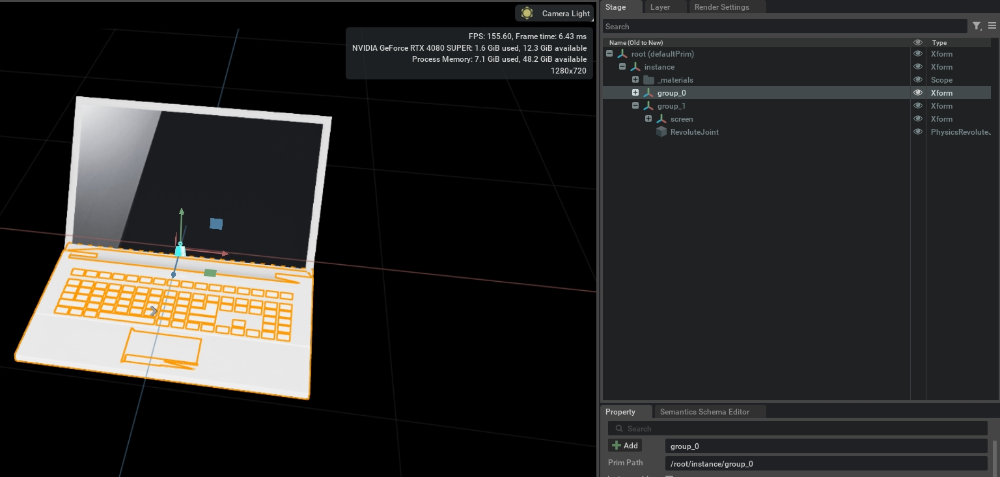
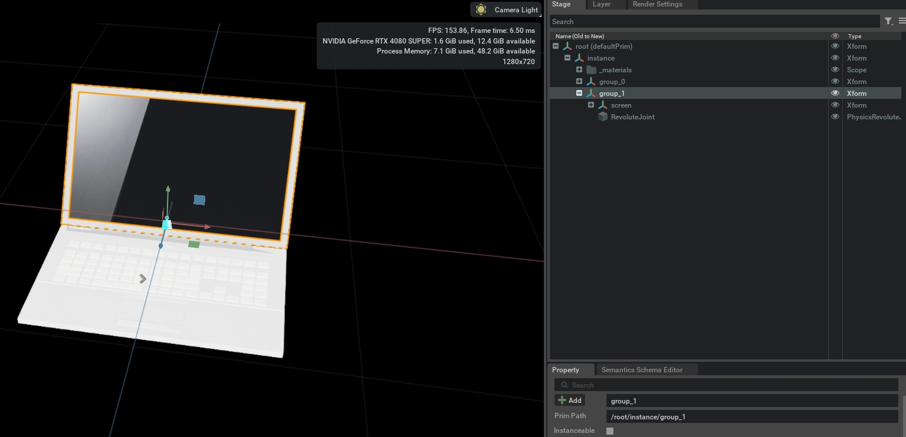
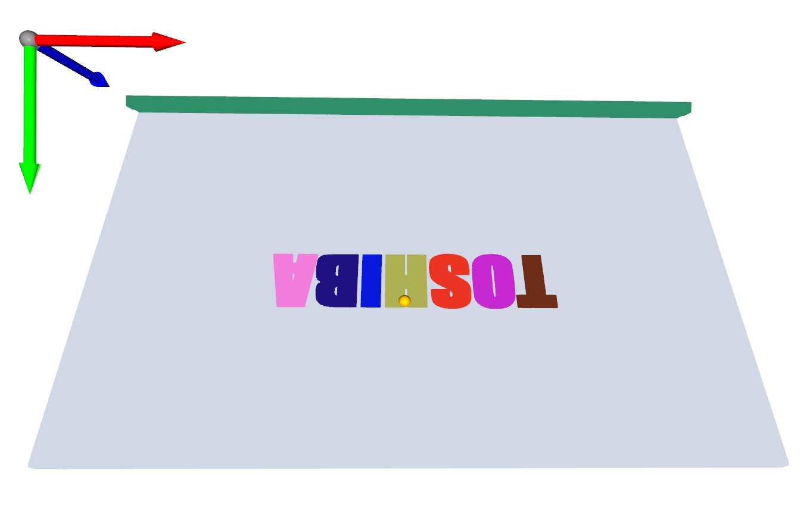
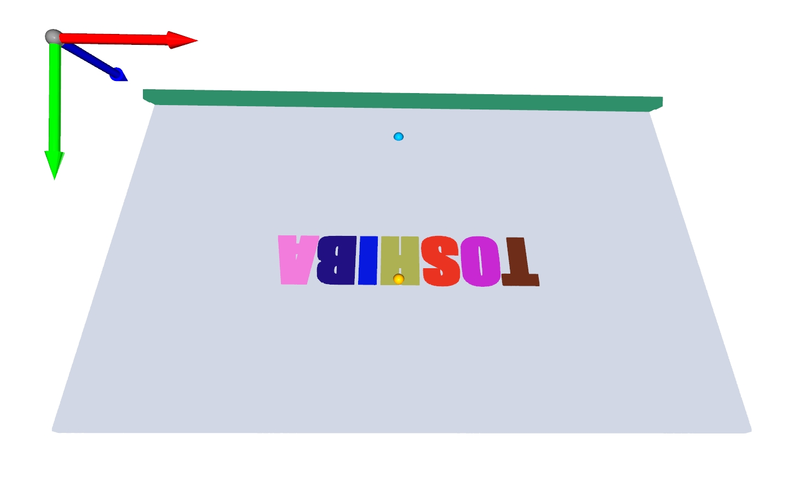

# Annotation Documentation

We provide an optimized and simplified annotation pipeline that removes many redundancies. No need to rename base_link, contact_link, etc. Keep the original hierarchy and naming as much as possible.

## 🗂️ File Information

| Configuration | Example | Description |
|---------------|---------|-------------|
| **DIR** | `YOUR_PATH_TO_DIR/usd` | Directory where USD files are stored |
| **USD_NAME** | `9748.usd` | Scene description file name |
| **INSTANCE_NAME** | `laptop9748` | Model identifier in the scene. You can name it yourself, preferably matching the generated file name |

## 🔧 Model Structure Configuration

| Component | Example | Description |
|-----------|---------|-------------|
| **link0_initial_prim_path** | `/root/group_1` | Absolute path in Isaac Sim for the "door" that interacts with the gripper. Check in the original USD |
| **base_initial_prim_path** | `/root/group_0` | Absolute path in Isaac Sim for the microwave base. Check in the original USD |
| **revolute_joint_initial_prim_path** | `/root/group_1/RevoluteJoint` | Absolute path in Isaac Sim for the revolute joint that opens/closes the microwave. Check in the original USD |
| **Joint Index** | `0` | Joint number, default is 0 |

## 🧭 Axis Configuration

| Axis Type | Example | Description | Visualization |
|-----------|---------|-------------|---------------|
| **LINK0_ROT_AXIS** | `x` | In the local coordinate system of the rotating joint, the axis direction pointing horizontally rightward |  |
| **BASE_FRONT_AXIS** | `z` | In the local coordinate system of the laptop base link, the axis direction facing the front |  |
| **LINK0_CONTACT_AXIS** | `-x` | In the local coordinate system of the contact link, the axis direction pointing horizontally leftward |  |

## 📏 Physical Parameters

| Parameter | Example | Description |
|-----------|---------|-------------|
| **SCALED_VOLUME** | `0.01` | Default value 0.01 for laptop objects |

---

# Point Annotation

| Point Type | Description | Visualization |
|------------|-------------|---------------|
| First Point (articulated_object_head) | `Desired base position where the gripper contacts the laptop` |  |
| Second Point (articulated_object_tail) | `The line direction from the first point should be perpendicular to the laptop's rotation axis` |  |

---