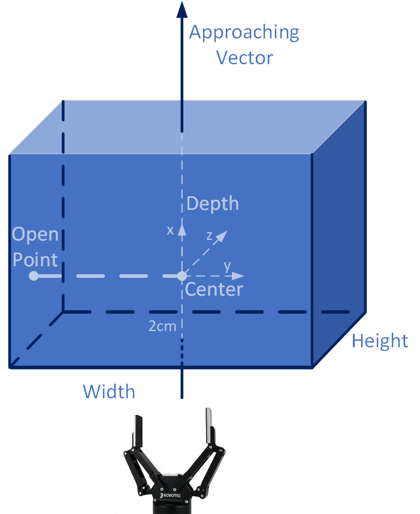

# Grasp Pose Generation and Visualization

## Installation

```bash
pip install torch numba numpy "open3d>=0.16.0" tqdm
```

## Part 1: Grasp Pose Generation

Grasp poses are generated based on mesh geometry and force closure analysis. The annotation pipeline follows the process from [AnyGrasp SDK](https://github.com/graspnet/anygrasp_sdk) and supports GPU acceleration. The output includes both dense annotations and filtered sparse annotations.

We use the **sparse annotation results** for grasping. The output is an `N x 17` array with the following structure:

```
[score, width, height, depth, view_angles (9), points (3), obj_ids (1)]
```

| Field | Dimensions | Description |
|-------|------------|-------------|
| `score` | 1 | Grasp quality score (0.1-1.0, lower is better) |
| `width` | 1 | Grasp width |
| `height` | 1 | Grasp height |
| `depth` | 1 | Grasp depth |
| `view_angles` | 9 | Can be reshaped to a 3x3 rotation matrix |
| `points` | 3 | 3D position of grasp center |
| `obj_ids` | 1 | Object identifier |

The definitions of `width`, `height`, and `depth` follow the conventions in the GraspNet and AnyGrasp papers. The `view_angles` combined with `points` and `depth` form the transformation `T_obj_tcp`. The gripper frame definition is consistent with the GraspNet API:

<p align="center">
  
</p>

**Note:** The generated grasp poses require coordinate transformation before use. Refer to `pose_post_process_fn()` in `template_robot.py` for details.

**References:**
- [AnyGrasp SDK](https://github.com/graspnet/anygrasp_sdk)
- [GraspNet API](https://github.com/graspnet/graspnetAPI)

### Usage

```bash
python gen_sparse_label.py --obj_path xxx.obj --unit mm --sparse_num 3000 --max_widths 0.1
```

**Arguments:**
- `--obj_path`: Path to the object mesh file (.obj format)
- `--unit`: Unit of the mesh, either `mm` (millimeters) or `m` (meters)
- `--sparse_num`: Number of sparse grasp poses to filter (recommended: 3000)
- `--max_widths`: Maximum gripper width (default: 0.1)

## Part 2: Grasp Pose Visualization

Visualize generated grasp poses on the object mesh.

### Usage

```bash
python vis_grasp.py --obj_path xxx.obj --N 100 --unit mm
```

**Arguments:**
- `--obj_path`: Path to the object mesh file (.obj format)
- `-N`: Number of grasp poses to visualize
- `--unit`: Unit of the mesh, either `mm` (millimeters) or `m` (meters)
